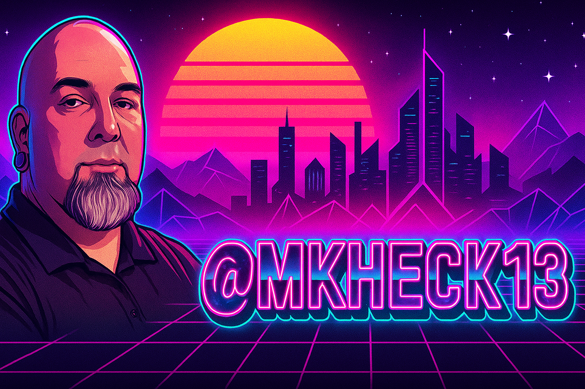

  <picture>
    <source srcset="images/lightmodecyber.png" media="(prefers-color-scheme: light)" />
    <source srcset="images/cyberpunk-banner.png" media="(prefers-color-scheme: dark)" />
    
  </picture>

<h1 align="center">🌆 Welcome to My Synthwave Terminal 🌆</h1>

  

---

### 🛠️ Technologies I Work With

  <!-- JavaScript -->
  <picture>
    <source srcset="https://img.shields.io/badge/JavaScript-F7DF1E?style=flat&logo=javascript&logoColor=black" media="(prefers-color-scheme: light)" />
    <source srcset="https://img.shields.io/badge/JavaScript-FFD700?style=flat&logo=javascript&logoColor=black" media="(prefers-color-scheme: dark)" />
    
  </picture>

  <!-- TypeScript -->
  <picture>
    <source srcset="https://img.shields.io/badge/TypeScript-3178C6?style=flat&logo=typescript&logoColor=white" media="(prefers-color-scheme: light)" />
    <source srcset="https://img.shields.io/badge/TypeScript-00FFFF?style=flat&logo=typescript&logoColor=black" media="(prefers-color-scheme: dark)" />
    
  </picture>

  <!-- React -->
  <picture>
    <source srcset="https://img.shields.io/badge/React-61DAFB?style=flat&logo=react&logoColor=black" media="(prefers-color-scheme: light)" />
    <source srcset="https://img.shields.io/badge/React-00F0FF?style=flat&logo=react&logoColor=black" media="(prefers-color-scheme: dark)" />
    
  </picture>

  <!-- TailwindCSS -->
  <picture>
    <source srcset="https://img.shields.io/badge/TailwindCSS-06B6D4?style=flat&logo=tailwind-css&logoColor=white" media="(prefers-color-scheme: light)" />
    <source srcset="https://img.shields.io/badge/TailwindCSS-FF00CC?style=flat&logo=tailwind-css&logoColor=white" media="(prefers-color-scheme: dark)" />
    
  </picture>

  <!-- Next.js -->
  <picture>
    <source srcset="https://img.shields.io/badge/Next.js-000000?style=flat&logo=nextdotjs&logoColor=white" media="(prefers-color-scheme: light)" />
    <source srcset="https://img.shields.io/badge/Next.js-FF0080?style=flat&logo=nextdotjs&logoColor=white" media="(prefers-color-scheme: dark)" />
    
  </picture>

  <!-- Node.js -->
  <picture>
    <source srcset="https://img.shields.io/badge/Node.js-339933?style=flat&logo=node.js&logoColor=white" media="(prefers-color-scheme: light)" />
    <source srcset="https://img.shields.io/badge/Node.js-00FFAB?style=flat&logo=node.js&logoColor=black" media="(prefers-color-scheme: dark)" />
    
  </picture>

---

### 📈 Stats & Activity

<!-- Codewars Stats -->

  

<!-- Top Languages -->

  <picture>
    <source srcset="https://github-readme-stats.vercel.app/api/top-langs/?username=mkheck13&layout=compact&theme=default" media="(prefers-color-scheme: light)" />
    <source srcset="https://github-readme-stats.vercel.app/api/top-langs/?username=mkheck13&layout=compact&theme=synthwave" media="(prefers-color-scheme: dark)" />
    
  </picture>

<!-- GitHub Stats -->

  <picture>
    <source srcset="https://github-readme-stats.vercel.app/api?username=mkheck13&show_icons=true&theme=default" media="(prefers-color-scheme: light)" />
    <source srcset="https://github-readme-stats.vercel.app/api?username=mkheck13&show_icons=true&theme=synthwave" media="(prefers-color-scheme: dark)" />
    
  </picture>

<!-- Streak Stats -->

  <picture>
    <source srcset="https://streak-stats.demolab.com/?user=mkheck13&theme=default" media="(prefers-color-scheme: light)" />
    <source srcset="https://streak-stats.demolab.com/?user=mkheck13&theme=synthwave" media="(prefers-color-scheme: dark)" />
    
  </picture>

---

### 🎯 About Me

🌐 Passionate full-stack developer  
🌱 Always learning new tech  
⚡ Obsessed with aesthetic and clean code  
🕹️ Synthwave, Cyberpunk, and Code = 🔥

---

### 💬 Let’s Connect!

)
